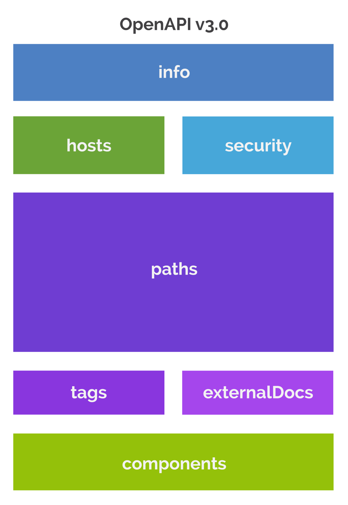

<!-- markdownlint-configure-file {
  "MD033": false,
  "MD041": false
} -->


# OAS2Apigee API Proxy CI/CD

<div align="center">

[Key Features](#key-features) •
[Methodology](#methodology) •
[The Why?](#the-why) •
[Background](#background) •
[Getting Started](#getting-started) •
[Limitations](#limitations) •
[Author](#book-author)


</div>

<br />

Welcome to `oas2apigee-cicd` repository!

Within this repository you will find the **FIRST end-to-end** reference solution of it's kind for automating creation & deployment of [Apigee][apigee] [API proxies][apigee-api-proxy] from [OpenAPI Specification][oas] files within entire [Google Cloud Apigee Community][gcloud-apigee-community]!

## Key Features

- Supports Apigee X / Hybrid.
- Leverage fast API development.
- Follows best practices.
- Decoupled CI / CD.
- CI / CD is a managed service.
- High maintainabilty.
- Cost effective as your pipeline will only trigger to changes in source code.
- Highly flexible.

## Methodology

### 1. Tools and Dependencies

This solution is using:

- OpenAPI Spec static code analysis using [@stoplight/spectral-cli][apigee-automation-spectral] OpenAPI linter (standalone via node).
- API proxy bundle generation and deployment using [apigeecli][apigee-automation-apigeecli] (Golang binary dependency).
- Integration testing of the deployed proxy using [apickli][apigee-automation-apickli] + [CucumberJS][apigee-automation-cucumberjs] (standalone via node).
- CI / CD solution using [Azure Pipelines][azure-pipelines].
- [apigee-core-yaml-pipelines-templates][apigee-core-yaml-pipelines-templates] CI / CD framework.

### 2. Folder Structure and Naming Conventions

An API developer will have to allocate single repository per API proxy where he can manage the proxy in the form of `OAS3.x` files:

- The API proxy suggested name on the organization should be: `{API_NAME}-{API_VERSION}`.
- The API proxy suggested base path should be: `/{API_NAME}/{API_VERSION}`.
- Within `oas/<oas_filename>.yaml` file:

  ```yaml
  ---
  openapi: "3.0.2"
  info:
  title: {{ title_name }}
  description: {{ api_description }}
  version: {{ oas_file_version }}
  servers:
    - url: {{ base_url }}/{{ api_proxy_base_url }}
      description: Development Server
    ...
  ```

  > :memo: **Notes:**

  - `{{ title_name }}`: **REQUIRED**. The title of the API. For example `ABOMIS Airports`.
  - `{{ api_description }}`: **RECOMMENDED**. A short description of the API and will resolve to be your API proxy description on Apigee UI console.
  - `{{ oas_file_version }}`: **REQUIRED**. The version of the OpenAPI document (which is distinct from OAS version or the API implementation version). For example `"1.0"`.
  - `{{ base_url }}`: **REQUIRED**. is basically `http[s]://<hostname>`. This is the hostname specified in an [environment group][apigee-envgroups]
  - `{{ api_proxy_base_url }}`: **REQUIRED**. is your to-be-generated API proxy base path and should follow this naming convention: `/{API_NAME}/{API_VERSION}` as a best practice to leverage API versioning. For example `/abomis/v1`
  - Make sure that you have **`n`** `servers field` elements where **`n`** is the number of your staging environments. Each server represents your API call entrypoint to a specific environment from the client side.

<div align="center">

:bulb: **Tip:** see [info object][oas-github-info-field] to learn more.

</div>

- Folder structure:

  <pre>
  .
  ├── .gitignore
  ├── .spectral.yaml          // used by spectral lint command to apply linting rules
  ├── README.md
  ├── cicd/
  │   ├── build.yaml
  │   └── release.yaml
  ├── docs/                   // store relative docs and assets if required
  │
  │
  ├── oas/                    // this is where you can store your oas file(s). you can have multiple
  │   │                       // files but only one will be deployed by your pipeline
  │   │
  │   └── {oas_filename}.yaml
  ├── package-lock.json
  ├── package.json
  └── test/
      └── integration/        // functional testing scripts
  </pre>

## The Why?

- API developers would rather work with YAML files than Apigee API proxies XML files due to it's complexity, they can use this solution to quickly generate basic functional API proxies at an incredible fast pace and extend it's functionalities if required in the future using the UI console or [abomis-airports][abomis-airports] approach.
- Leverage fast API development.
- Enterprises and teams should use source code control and CI / CD for proxy development and deployment (configuration management).
- Too easy to lose or overwrite revisions of your API when using the UI.

## Background

&nbsp;&nbsp;&nbsp;&nbsp;[Apigee][apigee] is a platform for developing and managing APIs. By fronting services with a proxy layer, Apigee provides an abstraction or facade for your backend service APIs and provides security, rate limiting, quotas, analytics, and more.

<div align="center">

![Apigee Overview Diagram][apigee-diagram]

</div>

&nbsp;&nbsp;&nbsp;&nbsp;Apigee enables you to provide secure access to your services with a well-defined API that is consistent across all of your services, regardless of service implementation. A consistent API:

- Makes it easy for app developers to consume your services.
- Enables you to change the backend service implementation without affecting the public API.
- Enables you to take advantage of the analytics, developer portal, and other features built into Apigee.

&nbsp;&nbsp;&nbsp;&nbsp;Rather than having app developers consume your services directly, they access an [API proxy][apigee-api-proxy] created on Apigee.

<div align="center">

![Apigee Proxy Model Diagram][apigee-proxy-model-v1]

> :bulb: **Learn More:** [Understanding APIs and API proxies][apigee-docs-understanding-apis-and-proxies].

</div>

&nbsp;&nbsp;&nbsp;&nbsp;An API proxy is a thin application program interface that exposes a stable interface for an existing service or services.

&nbsp;&nbsp;&nbsp;&nbsp;API proxies allow developers to define an API without having to change underlying services in the back end. This works by decoupling the front-end API from the back-end services, which is what shields the app from code changes on the back end. The benefit to an API proxy is that it is essentially a simple and lightweight API gateway

> An API proxy consists of a bundle of XML configuration files and code (such as JavaScript and Java).

---

&nbsp;&nbsp;&nbsp;&nbsp;The [OpenAPI Specification (OAS)][oas] defines a standard, language-agnostic interface to RESTful APIs which allows both humans and computers to discover and understand the capabilities of the service without access to source code, documentation, or through network traffic inspection. When properly defined, a consumer can understand and interact with the remote service with a minimal amount of implementation logic.

<div align="center">

![OAS and Swagger][oas-and-swagger]

</div>

&nbsp;&nbsp;&nbsp;&nbsp;An OpenAPI definition can then be used by documentation generation tools to display the API, code generation tools to generate servers and clients in various programming languages, testing tools, and many other use cases.

<div align="center">



> :bulb: **Learn More:** [Understanding OpenAPI Spec 3.0][oas-github-v3.0].

</div>

There are several important reasons to use the OpenAPI specification:

- Single point of truth.
- Automation
- Readable, updated live documentation.
- Industry standard.

## Getting Started

### 1. Prerequisites

- Existing Apigee X / Hybrid organization.
- Existing Apigee environment(s) & environment group(s).
- Two existing Azure DevOps pipelines with proper service connections:
  1. One for the build, suggested naming convention: `<REPO_NAME>-ci`.
  2. One for the release, suggested naming convention: `<REPO_NAME>-cd`.
- Existing Azure DevOps environment(s).
- Existing backend service, in this solution, I have deployed a mock API proxy named `aeroapi-v1` which can be found in [docs/assets/proxy-bundles][proxy-bundles-assets] to simulate a backend dependency with the minimum required effort.
- Preferred but not required to have technical knowledge of API proxy as code management and configuration (proxies, targets, policies, kvms,...etc).
- Technical knowledge of Azure DevOps pipelines to operate and customize the stages if needed.
- Preferred but not required to have technical knowledge of Npm's `package.json` file to customize if needed.
- GCP service account with the following roles (or a custom role with all required permissions):
  - `apigee.environmentAdmin`
  - `apigee.apiAdmin`
  - `apigee.admin` _(Required only for org-level config)_

> :bulb: **Tip:** see [Apigee roles][apigee-docs-roles-list].

- Create service account key and download it's key:

```bash
gcloud iam service-accounts keys create "${SA_NAME}"-key.json --iam-account="${SA_EMAIL}" --key-file-type=json
```

> :bulb: **Tip:** SA_EMAIL = {SA_NAME}@{PROJECT_ID}.iam.gserviceaccount.com

### 2. Initialize a Repository

Create a GitHub repository

```bash
GIT_URL='https://github.com/ORG/REPO.git'
```

> :memo: **Note:** You can use any SCM solution you want.

```bash
git clone https://github.com/ShehabEl-DeenAlalkamy/oas2apigee-cicd.git
cd oas2apigee-cicd
git init
git remote add my-repo "${GIT_URL}"
git checkout -b feature/oas2apigee-cicd
git add .
git commit -m "initial commit"
git push -u my-repo feature/oas2apigee-cicd
```

### 3. Run the Pipeline

- Create Variable Groups for your pipeline following these naming conventions:

  - `<REPO_NAME>-common`:
    - For common variables that are the same on all environments.
    - Should contain:
      - `org`: Apigee's organization.
      - `proxyName`: Your API proxy name on Apigee organization **e.g** `abomis-v1`.
      - `oasFileName`: name of your OAS3.x file that you want to deploy **e.g** `abomis-v1.yaml`.
      - `initialTargetEndpoint`: **OPTIONAL** Your API proxy target endpoint which will be attached to your API proxy bundle zip file artifact produced by your build pipeline. If not declared by default, the `initialTargetEndpoint` will be resolved to the `servers[0].url` base url within your OAS file.
      - `gcpServiceAccount`: paste the content of your your GCP service account key file as a **WHOLE**.
        > :warning: **Warning:** Make sure to check "Keep this value secret".
  - `<REPO_NAME>-{ENVIRONMENT}-env`:
    - For variables that are environment dependent.
    - Should contain:
      - `env`: Apigee environment to deploy your API proxy to.
      - `hostname`: Your specified hostname within your environment group.
      - `targetEndpoint`: Your backend environment specific url **e.g** `https://dev-target-server.example.com`.
        > :warning: **Warning:** Make sure to properly configure your DNS to route your `hostname` to your Apigee organization.

- Update:

  - [build pipeline][build-pipeline-file]:

    - The following are the supported params:

      ```yaml
      parameters:
        buildProfile: # determines how the pipeline will behave
          type: { { build_profile_type } } # type of the build profile e.g. 'api-proxies', 'sharedflows', ..etc. 'api-proxies' value is the only supported value
          name:
            { { build_profile_name } } # can be 'mvn-plugins' or 'oas2apigee'
            # 'mvn-plugins': build api proxies using Apigee Deploy & Apigee Config Maven Plugins
            # 'oas2apigee': build api proxies using apigeecli to deploy API proxies using OAS3.x files
            # use 'oas2apigee' for this solution
          version: { { build_profile_version } } # '1' is the only supported version currently
        variableGroups:
          - { { common_variable_group } } # variable group for common variables across all environments, e.g gcpServiceAccount, org & proxyDesc
            # for example 'abomis-common'
      ```

  - [release pipeline][release-pipeline-file]:

    - The following are the supported params:

      ```yaml
        parameters:
          releaseProfile: {{ release_profile }} # which Azure DevOps environments to deploy to, currently 'custom-release' is the only supported value
          deploymentProfile: # how to deploy your API proxy
            type: {{ deployment_profile_type }} # 'api-proxies' value is the only supported value
            name: {{ deployment_profile_name }} # 'mvn-plugins' or 'oas2apigee' are supported. enter 'oas2apigee' for this solution
            version: {{ deployment_profile_version }} # '1' is the only supported value
          artifactAlias: {{ build_pipeline_resource_identifier }} # can be specified in resources.pipelines[0].pipeline
          artifactName: {{ proxy_bundle_artifact_name }} # by default it is named 'oas2apigee-artifacts' in your build pipeline
          commonVariableGroups:
            - {{ common_variable_group }} # your common variables e.g gcpServiceAccount, org & proxyDesc for example 'abomis-common'
          releaseList: # required for 'custom-release' release profile, specify list of your deployment environments
            - stageName: {{ stage_name }} # identifier for you stage, for example 'Dev'
              displayName: {{ display_name }} # display name shown in your release pipeline run, for example 'Dev'
              variableGroups: # your environment specific variable groups
                - {{ env_variable_group }} # for example 'abomis-dev-env'
                ...
              environment: {{ azure_devops_environment }} # your deployment environment for example 'abomis-dev'
            ...
      ```

- Configure:

  - Build pipeline YAML source to be at: `cicd/build.yaml`.

  - Release pipeline YAML source to be at: `cicd/release.yaml`.

- Run your build pipeline by clicking on "Run Pipeline" button.

- Check your build pipeline:

<div align="center">

![Build Pipeline Stages][build-pipeline-stages]

</div>

- By default, your build pipeline was built to follow best practices by publishing all of the tests results in the **'Tests'** tab for a unified UI purpose.

> :memo: **Note:**
>
> - Spectral linting will not produce tests results on succeeded runs, it will only show the results on error.
> - The pipeline has been designed to fail on warnings log level as well to ensure high quality OpenAPI Spec documentation.

<div align="center">

![Static Code Analysis Failed Scenario Results in 'Tests' Tab][build-pipeline-sca-tests-tab]

</div>

- Your build pipeline produces a single artifact by default:
  - `oas2apigee-artifacts` - Contains all of the artifacts needed by your release pipeline to deploy. You can download your created API proxy bundle zip file to extend it's functionality using [abomis-airports][abomis-airports] approach.

<div align="center">

![Build Pipeline Artifacts][build-pipeline-artifacts]
_Build Pipeline Artifacts_

</div>

- On your `main`/`master`, your release pipeline will be auto triggered and start releasing your API proxy to your specified `releaseList` environments.

- Check your release pipeline:

<div align="center">

![Release Pipeline UI Dashboard][release-pipeline-dashboard]

</div>

<div align="center">

![Release Pipeline UI - Prod Stage Requires Manual Approval][release-pipeline-dashboard-pending-stage]
_Production environment has been configured to require manual approval_

</div>

<div align="center">

![Release Pipeline Stages][release-pipeline-stages]

</div>

- You can check your functional testing results in the **'Tests'** tab:

<div align="center">

![Functional Testing Results Report][release-pipeline-ft-tests-tab]
_Tests Results (Functional Testing for 3 environments)_

</div>

- Check your Apigee organization's API proxies:

<div align="center">

![abomis-v1 UI - Overview Tab][apigee-proxies-01]

</div>

- Test your API proxy on all of your environments from your OAS file:

a. Development Environment:

<div align="center">

![Swagger Editor - Dev Environment - 01][apigee-proxies-live-dev-01]

![Swagger Editor - Dev Environment - 02][apigee-proxies-live-dev-02]

</div>

b. Test Environment:

<div align="center">

![Swagger Editor - Test Environment - 01][apigee-proxies-live-test-01]

![Swagger Editor - Test Environment - 02][apigee-proxies-live-test-02]

</div>

c. Production Environment:

<div align="center">

![Swagger Editor - Prod Environment - 01][apigee-proxies-live-prod-01]

![Swagger Editor - Prod Environment - 02][apigee-proxies-live-prod-02]

</div>

Congratulations! you have deployed your first API proxy successfully. Now you have created your first live documentation for your API&nbsp;&nbsp;: )

<br />

---

## Limitations

- OAS2Apigee approach will never generate a fully featured API proxy. It can only support basic policies:
  1. [CORS Policy][apigee-x-policies-cors] (added by default).
  2. [OASValidation Policy][apigee-x-policies-oasvalidation] (added by default).
  3. [OAuthV2 Policy][apigee-x-policies-oauthv2] (customly added).
  4. [VerifyAPIKey Policy][apigee-x-policies-vak] (customly added).
  5. [SpikeArrest Policy][apigee-x-policies-spikearrest] (customly added).
  6. [Quota Policy][apigee-x-policies-quota] (customly added).
  
  <br />

  > :bulb: **Tip:** see [custom policies][apigeecli-custom-policies].
- The solution doesn't support creating Apigee configuration resources.
- The solution doesn't support mock API proxies (API proxies with no target endpoints).

<br />

## ⚔️ Developed By

<a href="https://www.linkedin.com/in/shehab-el-deen/" target="_blank"></a>

Shehab El-Deen Alalkamy

<br />

## :book: Author

Shehab El-Deen Alalkamy

<!--*********************  R E F E R E N C E S  *********************-->

<!-- * Links * -->

[apigee]: https://cloud.google.com/apigee/docs/api-platform/get-started/what-apigee
[apigee-api-proxy]: https://cloud.google.com/apigee/docs/api-platform/fundamentals/understanding-apis-and-api-proxies#:~:text=The%20Missing%20Link.-,What%20is%20an%20API%20proxy%3F,same%20API%20without%20any%20interruption.
[oas]: https://swagger.io/specification/
[gcloud-apigee-community]: https://www.googlecloudcommunity.com/gc/Apigee/bd-p/cloud-apigee
[azure-pipelines]: https://azure.microsoft.com/en-us/services/devops/pipelines/
[apigee-automation-spectral]: https://stoplight.io/open-source/spectral
[apigee-automation-apigeecli]: https://github.com/apigee/apigeecli#readme
[apigee-automation-apickli]: https://github.com/apickli/apickli
[apigee-automation-cucumberjs]: https://github.com/cucumber/cucumber-js
[apigee-core-yaml-pipelines-templates]: https://github.com/ShehabEl-DeenAlalkamy/apigee-core-yaml-pipeline-templates
[apigee-envgroups]: https://cloud.google.com/apigee/docs/api-platform/fundamentals/environments-overview
[oas-github-info-field]: https://github.com/OAI/OpenAPI-Specification/blob/main/versions/3.0.0.md#fixed-fields-1
[abomis-airports]: https://github.com/ShehabEl-DeenAlalkamy/abomis-airports
[apigee-docs-understanding-apis-and-proxies]: https://cloud.google.com/apigee/docs/api-platform/fundamentals/understanding-apis-and-api-proxies
[oas-github-v3.0]: https://github.com/OAI/OpenAPI-Specification/blob/main/versions/3.0.0.md#openapi-specification
[proxy-bundles-assets]: docs/assets/proxy-bundles/
[apigee-docs-roles-list]: https://cloud.google.com/iam/docs/understanding-roles#apigee-roles
[build-pipeline-file]: cicd/build.yaml
[release-pipeline-file]: cicd/release.yaml
[apigee-x-policies-cors]: https://cloud.google.com/apigee/docs/api-platform/reference/policies/cors-policy#default-policy
[apigee-x-policies-oasvalidation]: https://cloud.google.com/apigee/docs/api-platform/reference/policies/oas-validation-policy
[apigee-x-policies-oauthv2]: https://cloud.google.com/apigee/docs/api-platform/reference/policies/oauthv2-policy
[apigee-x-policies-vak]: https://cloud.google.com/apigee/docs/api-platform/reference/policies/verify-api-key-policy#:~:text=The%20Verify%20API%20Key%20policy%20lets%20you%20enforce%20verification%20of,associated%20with%20your%20API%20products.
[apigee-x-policies-spikearrest]: https://cloud.google.com/apigee/docs/api-platform/reference/policies/spike-arrest-policy
[apigee-x-policies-quota]: https://cloud.google.com/apigee/docs/api-platform/reference/policies/quota-policy
[apigeecli-custom-policies]: https://github.com/apigee/apigeecli#security-policies

<!-- * Images * -->

[apigee-diagram]: docs/assets/imgs/apigee-diagram.png
[apigee-proxy-model-v1]: docs/assets/imgs/apigee-proxy-model-v1.png
[oas-and-swagger]: docs/assets/imgs/oas-and-swagger.png
[build-pipeline-stages]: docs/assets/imgs/build-pipeline-stages.png
[build-pipeline-sca-tests-tab]: docs/assets/imgs/build-pipeline-sca-tests-tab.png
[build-pipeline-artifacts]: docs/assets/imgs/build-pipeline-artifacts.png
[release-pipeline-dashboard]: docs/assets/imgs/release-pipeline-dashboard.png
[release-pipeline-dashboard-pending-stage]: docs/assets/imgs/release-pipeline-dashboard-pending-stage.png
[release-pipeline-stages]: docs/assets/imgs/release-pipeline-stages.png
[release-pipeline-ft-tests-tab]: docs/assets/imgs/release-pipeline-ft-tests-tab.png
[apigee-proxies-01]: docs/assets/imgs/apigee-proxies-01.png
[apigee-proxies-live-dev-01]: docs/assets/imgs/apigee-proxies-live-dev-01.png
[apigee-proxies-live-dev-02]: docs/assets/imgs/apigee-proxies-live-dev-02.png
[apigee-proxies-live-test-01]: docs/assets/imgs/apigee-proxies-live-test-01.png
[apigee-proxies-live-test-02]: docs/assets/imgs/apigee-proxies-live-test-02.png
[apigee-proxies-live-prod-01]: docs/assets/imgs/apigee-proxies-live-prod-01.png
[apigee-proxies-live-prod-02]: docs/assets/imgs/apigee-proxies-live-prod-02.png
